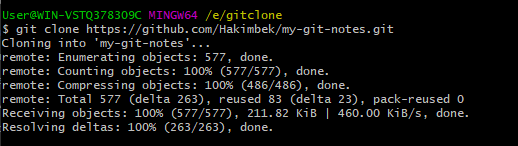
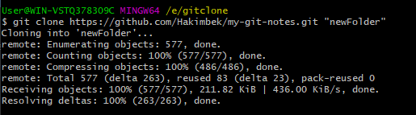
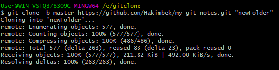

# Git Clone
In Git, cloning is the act of making a copy of any target repository. The target repository can be remote or local. You can clone your repository from the remote repository to create a local copy on your system. Also, you can sync between the two locations.

## Git Clone Command
The git clone is a command-line utility which is used to make a local copy of a remote repository. It accesses the repository through a remote URL.

Usually, the original repository is located on a remote server, often from a Git service like GitHub, Bitbucket, or GitLab. The remote repository URL is referred to the origin.

```
$ git clone <repository URL>  
```

Suppose, you want to clone a repository from GitHub, or have an existing repository owned by any other user you would like to contribute. Steps to clone a repository are as follows:

### Step 1:
  - Open GitHub and navigate to the main page of the repository.

### Step 2:
  - Under the repository name, click on Clone or download.
### Step 3:
  - Select the Clone with HTTPs section and copy the clone URL for the repository. For the empty repository, you can copy the repository page URL from your browser and skip to next step.
### Step 4:
  - Open Git Bash and change the current working directory to your desired location where you want to create the local copy of the repository.
### Step 5:
  - Use the git clone command with repository URL to make a copy of the remote repository. See the below command:

```
$ git clone https://github.com/ImDwivedi1/Git-Example.git  
```

Now, Press Enter. Hence, your local cloned repository will be created.



## Cloning a Repository into a Specific Local Folder
Git allows cloning the repository into a specific directory without switching to that particular directory. You can specify that directory as the next command-line argument in git clone command. See the below command:

```
$ git clone https://github.com/ImDwivedi1/Git-Example.git "newFolder"  
```



## Git Clone Branch
Git allows making a copy of only a particular branch from a repository. You can make a directory for the individual branch by using the git clone command. To make a clone branch, you need to specify the branch name with -b command. Below is the syntax of the command to clone the specific git branch:

```
$ git clone -b <Branch name><Repository URL>  
```
See the below command:

```
$ git clone -b master https://github.com/ImDwivedi1/Git-Example.git "newFolder"  
```


