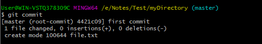
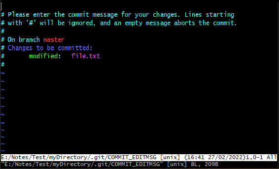
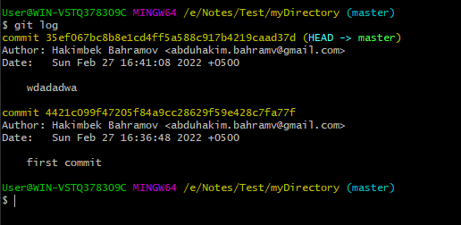

# Git Commit
It is used to record the changes in the repository. It is the next command after the git add
. Every commit contains the index data and the commit message. Every commit forms a parent-child relationship. When we add a file in Git, it will take place in the staging area. A commit command is used to fetch updates from the staging area to the repository.

The staging and committing are co-related to each other. Staging allows us to continue in making changes to the repository, and when we want to share these changes to the version control system, committing allows us to record these changes.

Commits are the snapshots of the project. Every commit is recorded in the master branch of the repository. We can recall the commits or revert it to the older version. Two different commits will never overwrite because each commit has its own commit-id. This commit-id is a cryptographic number created by SHA (Secure Hash Algorithm) algorithm.

## The git commit command
The commit command will commit the changes and generate a commit-id. The commit command without any argument will open the default text editor and ask for the commit message.

```
$ git commit  
```



As we run the command, it will prompt a default text editor and ask for a commit message. The text editor will look like as follows:



Press the Esc key and after that 'I' for insert mode. Type a commit message whatever you want. Press Esc after that ':wq' to save and exit from the editor. Hence, we have successfully made a commit.

We can check the commit by git log command. Consider the below output:



We can see in the above output that log option is displaying commit-id, author detail, date and time, and the commit message.

## Git commit -a
The commit command also provides -a option to specify some commits. It is used to commit the snapshots of all changes. This option only consider already added files in Git. It will not commit the newly created files.

```
$ git commit -a  
```

## Git commit -m
The -m option of commit command lets you to write the commit message on the command line. This command will not prompt the text editor. It will run as follows:
```
$ git commit -m "Commit message."  
```

We can also use the -am option for already staged files. This command will immediately make a commit for already staged files with a commit message. It will run as follows:
```
$ git commit -am "Commit message."  
```

## Git Commit Amend (Change commit message)
The amend option lets us to edit the last commit. If accidentally, we have committed a wrong commit message, then this feature is a savage option for us. It will run as follows:
```
$ git commit --amend  
```
The above command will prompt the default text editor and allow us to edit the commit message.
