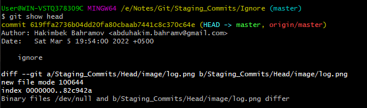
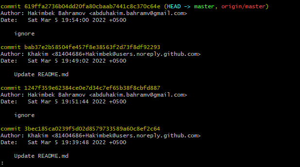

# Git Head
The HEAD points out the last commit in the current checkout branch. It is like a pointer to any reference. The HEAD can be understood as the "current branch." When you switch branches with 'checkout,' the HEAD is transferred to the new branch.

## Git Show Head
The git show head is used to check the status of the Head. This command will show the location of the Head.

```
$ git show HEAD  
```



In the above output, you can see that the commit id for the Head is given. It means the Head is on the given commit.

Now, check the commit history of the project. You can use the git log command to check the commit history. See the below output:



As we can see in the above output, the commit id for most recent commit and Head is the same. So, it is clear that the last commit has the Head.

We can also check the status of the Head by the commit id. Copy the commit id from the above output and paste it with the git show command. Its result is same as git show head command if the commit id is last commit's id. See the below output:

## Git Detached Head
GitHub keeps track of all commits or snapshots over time. If you check the 'git log' in your terminal, you can show all the previous commits up to the first commit. Detached HEAD mode allows you to discover an older state of a repository. It is a natural state in Git.

When Head doesn't point to most recent commit, such state is called detached Head. If you checkout with an older commit, it will stand the detached head condition. 
