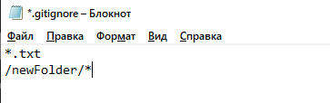

# Git Ignore
In Git, the term "ignore" is used to specify intentionally untracked files that Git should ignore. It doesn't affect the Files that already tracked by Git. Sometimes you don't want to send the files to Git service like GitHub. We can specify files in Git to ignore.

The file system of Git is classified into three categories:
### Tracked:
  - Tracked files are such files that are previously staged or committed.
### Untracked:
  - Untracked files are such files that are not previously staged or committed.
### Ignored:
  - Ignored files are such files that are explicitly ignored by git. We have to tell git to ignore such files.

Generally, the Ignored files are artifacts and machine-generated files. These files can be derived from your repository source or should otherwise not be committed. Some commonly ignored files are as follows:

- dependency caches
- compiled code
- build output directories, like */bin, /out, or /target*
- runtime file generated, like *.log, .lock, or .tmp*
- Hidden system files, like *Thumbs.db or.DS_Store*
- Personal IDE config files, such as *.idea/workspace.xml*

## Git Ignore Files
Git ignore files is a file that can be any file or a folder that contains all the files that we want to ignore. The developers ignore files that are not necessary to execute the project. Git itself creates many system-generated ignored files. Usually, these files are hidden files. There are several ways to specify the ignore files. The ignored files can be tracked on a *.gitignore* file that is placed on the root folder of the repository.

There is no explicit git ignore command; instead, the *.gitignore* file must be edited and committed by hand when you have new files that you wish to ignore. The *.gitignore* files hold patterns that are matched against file names in your repository to determine whether or not they should be ignored.

## How to Ignore Files Manually
There is no command in Git to ignore files; alternatively, there are several ways to specify the ignore files in git. One of the most common ways is the *.gitignore* file. Let's understand it with an example.

### The *.gitignore* file:
Rules for ignoring file is defined in the *.gitignore* file. The *.gitignore* file is a file that contains all the formats and files of the ignored file. We can create multiple ignore files in a different directory. Let's understand how it works with an example:

### Step1: 
Create a file named *.gitignore* if you do not have it already in your directory. To create a file, use the command touch. It will use as follows:

```
$ touch .gitignore  
```


The above command will create a *.gitignore* file on your directory. Remember, you are working on your desired directory. The above command will create a file named .gitignored. We can track it on the repository.

### Step2:
Now, add the files and directories to the *.gitignore* file that you want to ignore. To add the files and directory to the *.gitignore* the file, open the file and type the file name, directory name, and pattern to ignore files and directories.



In the above file, I have given one format and a directory to ignore. The above format \*.txt will ignore all the text files from the repository, and /newfolder/\* will ignore the newfolder and its sub-content. We can also give only the name of any file to ignore.

### Step3:
Now, to share it on Git, we have to commit it. The *.gitignore* file is still now in staging area; we can track it by git status command. 

Now to stage it, we have to commit it. To commit it, run the below command:

```
$ git add .gitignore  
$ git commit -m "ignored directory created."  
```

The above command will share the file *.gitignore* on Git. Now, we have ignored a pattern file and a directory in Git.

### Rules for putting the pattern in *.gitignore* file:
The rules for the patterns that can be put in the *.gitignore* file are as follows:

- Git ignores the Blank lines or lines starting with #.
- Only the Standard glob patterns work and will be applied recursively throughout the entire working tree.
- The patterns can be started with a forward slash (/) to avoid recursively.
- The patterns can be ended with a forward slash (/) to specify a directory.
- The patterns can be negated by starting it with an exclamation point (!).

## Global .gitignore:.
As we know that we can create multiple *.gitignore* files for a project. But Git also allows us to create a universal *.gitignore* file that can be used for the whole project. This file is known as a global .gitignore file. To create a global *.gitignore*, run the below command on terminal:

```
$ git config --global core.excludesfile ~/.gitignore_global  
```

The above command will create a global *.gitignore* file for the repository.

## How to List the Ignored Files?
In Git, We can list the ignored files. There are various commands to list the ignored files, but the most common way to list the file is the ls command. To list the ignored file, run the ls command as follows:

```
$ git ls-files -i --exclude-standard  
```

Or

```
$ git ls-files --ignore --exclude-standard  
```

The above command will list all available ignored files from the repository. In the given command, -I option stands for ignore and --exclude-standard is specifying the exclude pattern.
