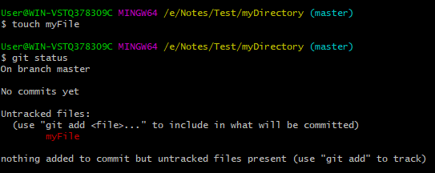

# Git *Init*
The **git init** command is the first command that you will run on Git. The git init command is used to create a new blank repository. It is used to make an existing project as a Git project. Several Git commands run inside the repository, but init command can be run outside of the repository.

The git init command creates a *.git* subdirectory in the current working directory. This newly created subdirectory contains all of the necessary metadata. These metadata can be categorized into **objects, refs** and **temp** files. It also initializes a HEAD pointer for the master branch of the repository.

## Creating the first repository
Git version control system allows you to share projects among developers. For learning Git, it is essential to understand that how can we create a project on Git. A repository is a directory that contains all the project-related data. There can also be more than one project on a single repository.

We can create a repository for blank and existing projects.

## Create a Repository for a Blank (New) Project:
To create a blank repository, open command line on your desired directory and run the *init* command as follows:

```
$ git init  
```

The above command will create an empty *.git* repository. Suppose we want to make a git repository on our desktop. To do so, open Git Bash on the desktop and run the above command.


The above command will initialize a *.git* repository on the desktop. Now we can create and add files on this repository for version control.

To create a file, run the **cat** or **touch** command as follows:

```
$ touch <file Name>  
```

To add files to the repository, run the git add command as follows:

```
$ git add <file name>  
```

## Create a Repository for an existing project
If you want to share your project on a version control system and control it with Git, then, browse your project's directory and start the git command line (Git Bash for Windows) here. To initialize a new repository, run the below command:

```
$ git init  
```

The above command will create a new subdirectory named *.git* that holds all necessary repository files. The .git subdirectory can be understood as a Git repository skeleton.

An empty repository *.git* is added to my existing project. If we want to start version-controlling for existing files, we have to track these files with git add command, followed by a commit.

We can list all the untracked files by git status command.
```
$ git status    
```



## Create a Repository and Directory Together
The git init command allows us to create a new blank repository and a directory together. The empty repository .git is created under the directory. Suppose I want to create a blank repository with a project name, then we can do so by the git init command. Consider the below command
```
$ git init NewDirectory  
```


In above command will create an empty *.git* repository under a directory named NewDirectory.
