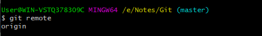
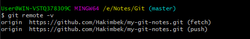
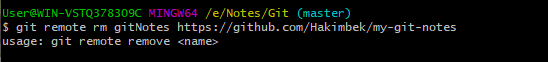
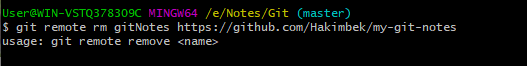

# Git Remote
In Git, the term remote is concerned with the remote repository. It is a shared repository that all team members use to exchange their changes. A remote repository is stored on a code hosting service like an internal server, GitHub, Subversion, and more. In the case of a local repository, a remote typically does not provide a file tree of the project's current state; as an alternative, it only consists of the .git versioning data.

The developers can perform many operations with the remote server. These operations can be a clone, fetch, push, pull, and more. 

## Check your Remote
To check the configuration of the remote server, run the git remote command. The git remote command allows accessing the connection between remote and local. If you want to see the original existence of your cloned repository, use the git remote command. It can be used as:

```
$ git remote  
```



The given command is providing the remote name as the origin. Origin is the default name for the remote server, which is given by Git.

### Git remote -v:
Git remote supports a specific option -v to show the URLs that Git has stored as a short name. These short names are used during the reading and write operation. Here, -v stands for verbose. We can use --verbose in place of -v. It is used as:
```
$ git remote -v  
```

Or

```
$ git remote --verbose  
```



## Git Remote Add
When we fetch a repository implicitly, git adds a remote for the repository. Also, we can explicitly add a remote for a repository. We can add a remote as a shot nickname or short name. To add remote as a short name, follow the below command:

```
$ git remote add <short name> <remote URL>  
```



I have pulled a repository using its short name instead of its remote URL. Now, the repository master branch can be accessed through a short name.

## Fetching and Pulling Remote Branch
You can fetch and pull data from the remote repository. The fetch and pull command goes out to that remote server, and fetch all the data from that remote project that you don't have yet. These commands let us fetch the references to all the branches from that remote.

To fetch the data from your remote projects, run the below command:
```
$ git fetch <remote>  
```
To clone the remote repository from your remote projects, run the below command:
```
$ git clone <remote>  
```
When we clone a repository, the remote repository is added by a default name "origin." So, mostly, the command is used as git fetch origin.

The git fetch origin fetches the updates that have been made to the remote server since you cloned it. The git fetch command only downloads the data to the local repository; it doesn't merge or modify the data until you don't operate. You have to merge it manually into your repository when you want.

To pull the repository, run the below command:
```
$ git pull <remote>  
```

The git pull command automatically fetches and then merges the remote data into your current branch. Pulling is an easier and comfortable workflow than fetching. Because the git clone command sets up your local master branch to track the remote master branch on the server you cloned.

## Pushing to Remote Branch
If you want to share your project, you have to push it upstream. The git push command is used to share a project or send updates to the remote server. It is used as:
```
$ git push <remote> <branch>  
```
To update the main branch of the project, use the below command:
```
$ git push origin master  
```
It is a special command-line utility that specifies the remote branch and directory. When you have multiple branches on a remote server, then this command assists you to specify your main branch and repository.

Generally, the term origin stands for the remote repository, and master is considered as the main branch. So, the entire statement "git push origin master" pushed the local content on the master branch of the remote location.
The git pull command automatically fetches and then merges the remote data into your current branch. Pulling is an easier and comfortable workflow than fetching. Because the git clone command sets up your local master branch to track the remote master branch on the server you cloned.

## Git Remove Remote
You can remove a remote connection from a repository. To remove a connection, perform the git remote command with remove or rm option. It can be done as:
```
$ git remote rm <destination>  
```
Or
```
$ git remote remove <destination>  
```



## Git Remote Rename
Git allows renaming the remote server name so that you can use a short name in place of the remote server name. Below command is used to rename the remote server:
```
$ git remote rename <old name> <new name>  
```

## Git Show Remote
To see additional information about a particular remote, use the git remote command along with show sub-command. It is used as:

```
$ git remote show <remote>  
```

It will result in information about the remote server. It contains a list of branches related to the remote and also the endpoints attached for fetching and pushing.

## Git Change Remote (Changing a Remote's URL)
We can change the URL of a remote repository. The git remote set command is used to change the URL of the repository. It changes an existing remote repository URL.

### Git Remote Set:
We can change the remote URL simply by using the git remote set command. Suppose we want to make a unique name for our project to specify it. Git allows us to do so. It is a simple process. To change the remote URL, use the below command:

```
$ git remote set-url <remote name> <newURL>  
```

The remote set-url command takes two types of arguments. The first one is \<remote name\>, it is your current server name for the repository. The second argument is \<newURL\>, it is your new URL name for the repository.
