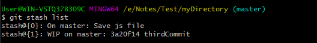

# Git Stash
Sometimes you want to switch the branches, but you are working on an incomplete part of your current project. You don't want to make a commit of half-done work. Git stashing allows you to do so. The git stash command enables you to switch branches without committing the current branch.

Generally, the stash's meaning is "store something safely in a hidden place." The sense in Git is also the same for stash; Git temporarily saves your data safely without committing.

Stashing takes the messy state of your working directory, and temporarily save it for further use. Many options are available with git stash. Some useful options are given below:

- Git stash
- Git stash save
- Git stash list
- Git stash apply
- Git stash changes
- Git stash pop
- Git stash drop
- Git stash clear
- Git stash branch

## Stashing Work
Let's understand it with a real-time scenario. I have made changes to my project **Test** in three files from two distinct branches. I am in a messy state, and I have not entirely edited any file yet. So I want to save it temporarily for future use. We can stash it to save as its current status. To stash, let's have a look at the repository's current status. To check the current status of the repository, run the git status command. The git status command is used as:

```
$ git status  
```


From the above output, you can see the status that there are two untracked file **css.txt, index.txt** available in the repository. To save it temporarily, we can use the git stash command. The git stash command is used as:

To save it temporarily, we can use the git stash command. The git stash command is used as:
```
$ git stash  
```


In the given output, the work is saved with git stash command. We can check the status of the repository.


As you can see, my work is just stashed in its current position. Now, the directory is cleaned. At this point, you can switch between branches and work on them.

## Git Stash Save (Saving Stashes with the message):
In Git, the changes can be stashed with a message. To stash a change with a message, run the below command:
```
$ git stash save "<Stashing Message>"  
```


The above stash will be saved with a message

## Git Stash List (Check the Stored Stashes)
To check the stored stashes, run the below command:
```
$ git stash list  
```



In the above case, I have made one stash, which is displayed as "stash@{0}: WIP on the test: 0a1a475 CSS file".

## Git Stash Apply
You can re-apply the changes that you just stashed by using the git stash command. To apply the commit, use the git stash command, followed by the apply option. It is used as:
```
$ git stash apply  
```

In case of more than one stash, you can use "git stash apply" command followed by stash index id to apply the particular commit. It is used as:

```
$ git stash apply <stash id>  
```

## Git Stash Changes
We can track the stashes and their changes. To see the changes in the file before stash and after stash operation, run the below command:

```
$ git stash show  
```

## Git Stash Pop (Reapplying Stashed Changes)
Git allows the user to re-apply the previous commits by using git stash pop command. The popping option removes the changes from stash and applies them to your working file.

The git stash pop command is quite similar to git stash apply. The main difference between both of these commands is stash pop command that deletes the stash from the stack after it is applied.
```
$ git stash pop  
```

## Git Stash Drop (Unstash)
The git stash drop command is used to delete a stash from the queue. Generally, it deletes the most recent stash. Caution should be taken before using stash drop command, as it is difficult to undo if once applied.

The only way to revert it is if you do not close the terminal after deleting the stash. The stash drop command will be used as:
The above command will re-apply the previous commits to the repository.

```
$ git stash drop  
```

In the above output, the most recent stash (stash@{0}) has been dropped from given three stashes. The stash list command lists all the available stashes in the queue.

We can also delete a particular stash from the queue. To delete a particular stash from the available stashes, pass the stash id in stash drop command. It will be processed as:
```
$ git stash drop <stash id>  
```

## Git Stash Clear
The git stash clear command allows deleting all the available stashes at once. To delete all the available stashes, operate below command:
```
$ git stash clear  
```

## Git Stash Branch
If you stashed some work on a particular branch and continue working on that branch. Then, it may create a conflict during merging. So, it is good to stash work on a separate branch.

The git stash branch command allows the user to stash work on a separate branch to avoid conflicts. The syntax for this branch is as follows:
```
$ git stash branch <Branch Name>  
```
it will delete all the stashes that exist in the repository.
